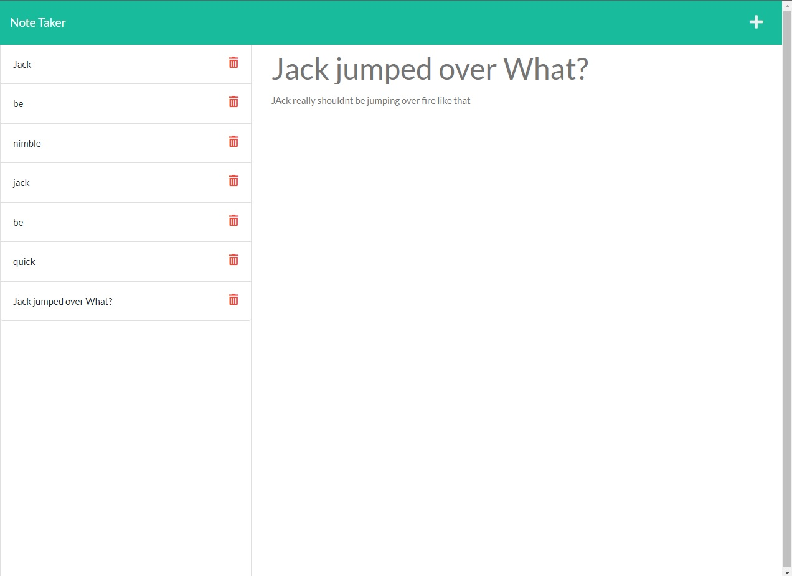

# E-Trapper-Keeper
 

## Description

A notetaking application that allows the users to save their notes in a JSON file. This project uses express and statically serves its webpages.

## Table of Contents

* [Installation](#installation)
* [Usage](#usage)
* [Credits](#credits)
* [License](#license)
* [Features](#features)
* [Contributing](#contributing)
* [Tests](#tests)
* [Questions](#questions)

## Installation

Clone the repo to your computer and run **npm i** or **yarn** first to install the required dependencies.

## Usage

To use the pre-deployed version on [heroku](https://e-trapper-keeper.herokuapp.com/notes) 

To deploy it on your own computer:
To use this project after installing the dependencies, start up the server using **npm run start** or **yarn run start**. The console will display what port the server is running on. depending on what port it is running on on your computer your port number may vary. afterwards vist in your browser localhost:portInUseHere (i.e. localhost:3002)

## Credits

UUID-RANDOM, Express, nodemon, and Trilogy

## License

MIT License

Copyright (c) 2022 Ryan Moon

Permission is hereby granted, free of charge, to any person obtaining a copy
of this software and associated documentation files (the "Software"), to deal
in the Software without restriction, including without limitation the rights
to use, copy, modify, merge, publish, distribute, sublicense, and/or sell
copies of the Software, and to permit persons to whom the Software is
furnished to do so, subject to the following conditions:

The above copyright notice and this permission notice shall be included in all
copies or substantial portions of the Software.

THE SOFTWARE IS PROVIDED "AS IS", WITHOUT WARRANTY OF ANY KIND, EXPRESS OR
IMPLIED, INCLUDING BUT NOT LIMITED TO THE WARRANTIES OF MERCHANTABILITY,
FITNESS FOR A PARTICULAR PURPOSE AND NONINFRINGEMENT. IN NO EVENT SHALL THE
AUTHORS OR COPYRIGHT HOLDERS BE LIABLE FOR ANY CLAIM, DAMAGES OR OTHER
LIABILITY, WHETHER IN AN ACTION OF CONTRACT, TORT OR OTHERWISE, ARISING FROM,
OUT OF OR IN CONNECTION WITH THE SOFTWARE OR THE USE OR OTHER DEALINGS IN THE
SOFTWARE.

## Features

* add notes
* delete notes
* view notes at a later date without havving to keep your browser open

## Contributing

If you would like to contribute please fork this repo and then submit a pull request.

## Tests

At this time there are no test associated with this repo

## Questions

Find me on github here: [here](http://github.com/Moonryc)

If you have any additional question feel free to email me at [rycmoon@gmail.com](mailto:rycmoon@gmail.com)
